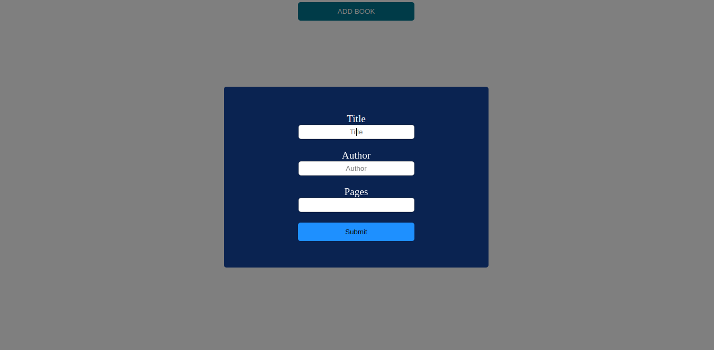

# Library
Creating an object that will contain a list of books

My first Object-Oriented Programming Project.I learnt how to use prototypes,filter()function,map()function,template literals,etc...

I also learnt how to use frameworks in CSS.